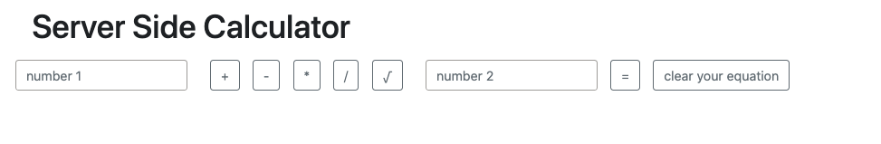

# Project Name

Jquery Server Side Calculator

## Description

Duration: One day sprint

This app serves up a basic, one-equation calculator.  The user may only use two numbers and one operator to create an equation. The output of the user-selected equation is shown as a list item. The list items are stored on a server and each list item remains on the DOM until either A.) the user presses the clear history button or B.) the server is reset.  Additionally the user can re-use their same equation by clicking on that list item. 

The problems here were three fold: 1. how to make the calculator single-use, 2. how store the user equation and output and 3. how to clear all the of users equations from DOM.  

In order to make the calculator single-use the operator buttons are disable after one is selected.  This keeps the user from entering more than one operator. Since the inputs are set up as a form it is always single-stage. That is, they can only take one input in each field and the form is reset upon pressing "=". 

Updating a server-side array with post requests solved the problem of storing user inputs and total. The server then processed that array with a calculation function to get the result of user inputs. A get request then fetched an object with user inputs and also the result the inputs. This was then displayed on the Dom. 

As mentioned prior, the object returned is displayed as a list item with both inputs, operator and result. Deleting the list items was accomplished simply by using a delete request and emptying the array of completed objects before the response was returned to the client-side.

Screenshots: 

