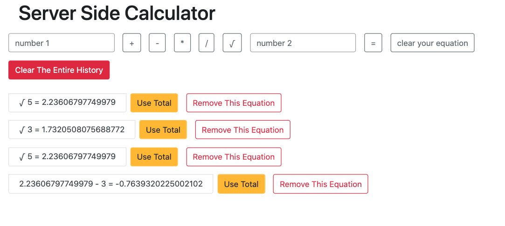

# Project Name

Jquery Server Side Calculator

## Description

Duration: One day sprint

This app serves up a basic, one-equation calculator.  The user may only use two numbers and one operator to create an equation. Without both numbers and an operator the app will not run and the equation will not be created.  If the user input is made correctly, the equations are sent to the server, processed and stored there.  The app requests the user-selected equation, with its total, from the server. When it is received it processed and displayed as a list item.  This data will live on the local server created until either the server is turned off or it is removed by the user with the remove/clear buttons. 

The problems here were three fold: 1. how to make the calculator single-use, 2. how store the user equation and total and 3. how to clear all the of users equations from DOM.  

In order to make the calculator single-use, the operator buttons are disabled after one is selected.  Conveniently, if the user changes their mind, the disabled buttons can be re-enabled by clicking again on that same operator. In order to ensure correct functionality the user must enter a number in both fields and select an operator to create an equation. A warning is displayed if user clicks "=" and those conditions are not met. 

To solve the problem of storing the user-made data, the client.js file uses a post request with node/express/ajax to send the data to a server. The server then passes the user data to a calculation function to get the total for the equation. Once that is completed it is stored as an array of objects that contain the equations and their totals. A get request then fetches the data and passes to a function that displays the equation with its total on the Dom. The equations can be deleted from the sever one by one with the delete this equation button.  

To clear the history of all equations was accomplished by using a clear entire history button and attaching it to a delete request and emptying the array of with equations and totals. In order to remove one equation at a time, the user may use the "remove this equation" button.  In order to remove this, the index value attached to list item is sent to the server with a delete request and the server removes the corresponding object.  Once the delete response is confirmed from the server the app runs a get request runs to retrieve the updated array from the server.  The updated array, without the removed equation, is displayed on the DOM. 

Finally, if the user intends to use the calculator as an instrument to complete compound equation a button use the total of an equation is next to listed equation. By pressing the button the first input receives the value of the total. 

Screenshots: 

